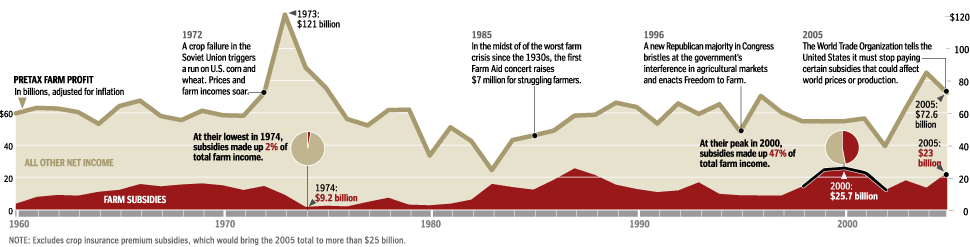
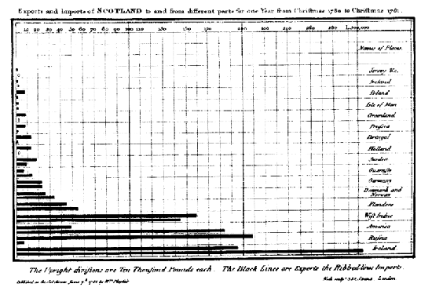
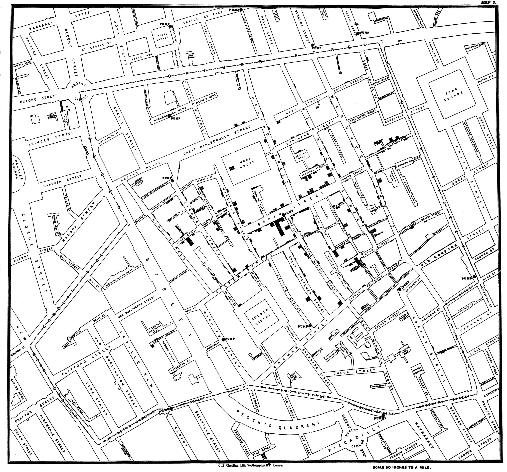
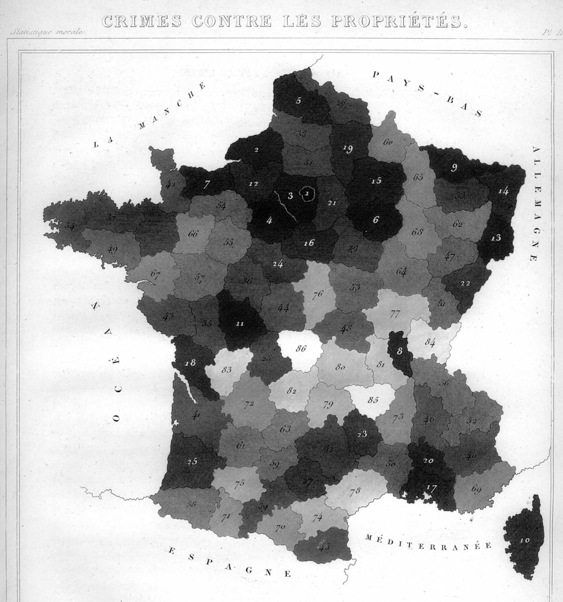
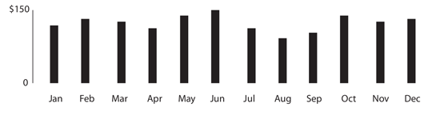
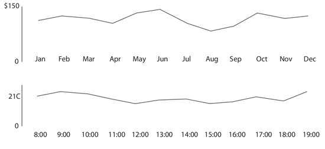
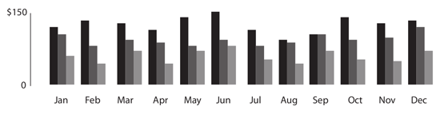
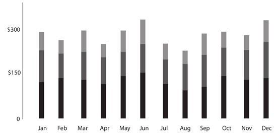
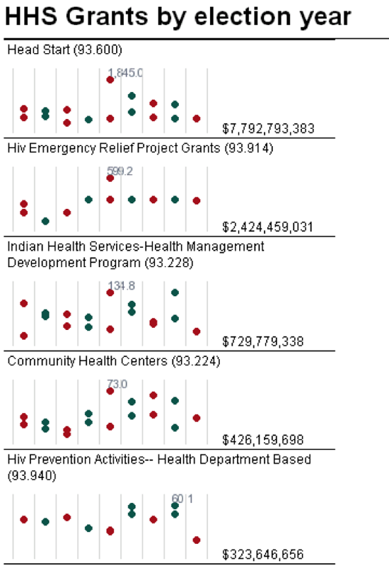

# Datová gramotnost ve třech krátkých krocích

Podobně jako slovo *gramotnost* označuje „schopnost získat a kriticky posoudit psané informace a vyjadřovat se srozumitelně v psaném projevu“, spojení *datová gramotnost* označuje schopnost získávat znalosti, kriticky uvažovat a srozumitelně se vyjadřovat prostřednictvím dat. Patří sem nejen jistý pojem o statistice, ale také schopnost práce s velkými objemy dat a představa o tom, jak vznikají, jak je navzájem propojit a jak je interpretovat.

Nezisková škola žurnalistiky *Poynter Institute* nabízí v rámci svého projektu *News University* předmět [Matematika pro novináře][1], ve kterém se studenti učí bezpečně pracovat například s procenty nebo aritmetickým průměrem. Zajímavé je, že tytéž koncepty se v těsném sousedství učí také žáci pátých ročníků základních škol, tedy děti ve věku 10–11 let.

[1]: http://www.newsu.org/courses/math-journalists

Pokud novináři potřebují pomoc s matematikou základní školy, musí mít průměrný newsroom k datové gramotnosti daleko. Což nutně vede k problémům – jak může novinář zpracovat pár čísel o změně klimatu, když neví, co znamená *interval spolehlivosti*? Jak může napsat článek o příjmech domácností, když si plete aritmetický průměr s mediánem?

Zároveň ale novinář k práci s daty nepotřebuje titul z matematiky. I pár jednoduchých postřehů může z čísel udělat lepší článek. [Jak říká Gerd Gigerenzer][2], profesor z Ústavu Maxe Plancka, lepší nástroje samy o sobě nedělají lepší žurnalistiku, pokud nejsou podepřené vlastní úvahou.

[2]: http://datadrivenjournalism.net/news_and_analysis/the_importance_of_numeracy_for_data_journalists

I bez větších znalostí matematiky nebo statistiky můžete udělat krok k lepší datové žurnalistice, stačí si položit následující tři jednoduché otázky.

## Odkud se data vzala?

### Fantastický růst HDP

Když chcete někoho omráčit, nejlépe se to dělá daty, která jste si sami vymysleli. Možná je to evidentní, ale kašírovat se dají i tak diskutované údaje, jakým je například HDP. Někdejší britský velvyslanec Craig Murray ve své knize [Murder in Samarkand][3] popisuje údaje o HDP Uzbekistánu, které vznikají na základě intenzivního vyjednávání místní vlády s mezinárodními organizacemi. Jinými slovy: nemají nic společného s místní ekonomikou.

[3]: http://www.amazon.com/Murder-Samarkand-Ambassadors-Controversial-Defiance/dp/1845962214

Vlády si HDP jakožto hlavní ukazatel výkonu ekonomiky hlídají kvůli dani z přidané hodnoty, která pro ně představuje hlavní zdroj příjmů. Když vláda žije z jiných zdrojů než DPH, nebo když nezveřejňuje svůj rozpočet, nemá důvod sbírat podklady pro výpočet HDP a je pro ni jednodušší výsledné číslo prostě vymyslet.

### Věčně rostoucí křivka zločinu

„Zločinnost ve Španělsku vzrostla o tři procenta,“ [píše El País][4]. Brusel trpí kriminalitou nelegálních přistěhovalců a drogově závislých, [tvrdí RTL][5]. Podobné zprávy vycházející z policejních statistik jsou běžné, ale o násilí příliš nevypovídají.

[4]: http://internacional.elpais.com/internacional/2008/09/29/actualidad/1222639208_850215.html
[5]: http://www.rtl.be/info/votreregion/bruxelles/835282/criminalite-en-hausse-a-bruxelles-la-faute-aux-illegaux-et-aux-drogues-

Můžeme věřit tomu, že v rámci Evropské unie data nikdo záměrně nezkresluje. Ale policisté umí vyjít vstříc systému: Pokud je například jejich osobní hodnocení vázané na počet zásahů, mají motivaci hlásit co nejvíc jednoduchých případů nevyžadujících vyšetřování. Například kouření trávy. Tím se vysvětluje, proč ve Francii za posledních 15 let statisticky vzato čtyřikrát přibylo trestných činů spojených s drogami, ačkoliv jejich spotřeba zůstává zhruba konstantní.

### Co můžete udělat

Kdykoliv pochybujete o důvěryhodnosti svých dat, ověřte si je, jako kdyby šlo o citát nějakého politika. V příkladu s Uzbekistánem stačí zavolat někomu, kdo v zemi delší dobu žije. („Máš dojem, že je země třikrát bohatší než v roce 1995, jak tvrdí oficiální čísla?“)

Co se týká policejních dat, sociologové často dělají studie, ve kterých se respondentů ptají, jestli byli terčem zločinu. Tyto studie jsou mnohem spolehlivější než policejní data. Možná proto se většinou nedostanou na titulku.

Existují i další testy, které vám pomohou lépe odhadnout důvěryhodnost dat (například [Benfordův zákon][6]), ale žádný z nich nenahradí vaše vlastní kritické myšlení.

[6]: http://cs.wikipedia.org/wiki/Benfordův_zákon

## Co přesně data říkají?

### Noční práce zdvojnásobuje riziko roztroušené sklerózy

Každý duševně zdravý Němec by po přečtení [tohoto titulku][7] jistě začal odmítat noční směny. Z článku ale nevyplývá, jak velké je vlastně výsledné riziko.

[7]: http://www.dmsg.de/multiple-sklerose-news/index.php?w3pid=news&kategorie=forschung&anr=2476

Vezměte si tisícovku Němců. Roztroušená skleróza se v průběhu života objeví u jednoho z nich. Kdyby všech tisíc pracovalo v noci, počet nemocných by poskočil na dva. Noční směny tedy představují dodatečné riziko jedna ku tisíci, nikoliv sto procent. Taková informace je pro praktické rozhodování o konkrétní pracovní nabídce jistě mnohem užitečnější.

### Mezi každými 15 Evropany je průměrně jeden negramotný

Výše uvedený titulek vypadá hrozivě. A je naprosto pravdivý. Mezi půl miliardou Evropanů je 36 miliónů těch, kteří nejspíš neumí číst. A [podle Eurostatu][8] také 36 miliónů těch, kterým ještě nebylo sedm let.

[8]: http://epp.eurostat.ec.europa.eu/portal/page/portal/statistics/search_database

Kdykoliv pracujete s průměrem, ujasněte si, z čeho se počítá. Je referenční populace rozdělená rovnoměrně? Díky nerovnoměrnému rozložení například většina lidí nadprůměrně dobře řídí auto. Mnozí řidiči se celý život obejdou bez nehody, případně bourají jen jednou. Naproti tomu menší počet nezodpovědných řidičů bourá často, čímž tlačí aritmetický průměr nehodovosti mnohem výš, než by běžný řidič ze své zkušenosti čekal. Totéž platí o rozdělení příjmů: většina lidí má podprůměrný plat a nadprůměrný počet končetin.

### Co můžete udělat

Vždy berte v úvahu rozložení ukazatele a jeho relativní četnost[^2]. Zkontrolujte si průměr, medián i modus (nejčastěji zastoupenou hodnotu), uděláte si o datech lepší představu. Uvědomte si kontext, v jakých řádech se pohybujete – viz příklad s roztroušenou sklerózou. A na závěr drobný tip: konkrétní příklady poměrů („jeden ze sta“) bývají pro čtenáře výrazně srozumitelnější než procenta (1 %).

[^2]: *base rate*, TODO.

## Jak spolehlivá jsou data?

### Problematická velikost vzorku

„80 % nespokojených se soudním systémem,“ [píše španělský list Diaro de Navarra][9]. Jak ale může zobecnit výsledky od osmi set respondentů na 46 miliónů Španělů? To je ukázkové mlácení prázdné slámy. Nebo ne?

[9]: http://www.diariodenavarra.es/noticias/mas_actualidad/sociedad/una_encuesta_revela_que_casi_los_espanoles_esta_insatisfecho_con_justicia_50090_1035.html

Při průzkumu velké skupiny lidí (řekněme přes několik tisíc) jen zřídka potřebujete více než tisíc respondentů, abyste dostáhli chyby pod 3 %. Jinými slovy, kdybyste zopakovali průzkum s úplně jiným vzorkem, v devíti případech z deseti byste se dostali nejvýš na tři procenta daleko od výsledků z prvního pokusu. Statistika je mocná zbraň a velikost vzorku bývá u špatných studií na vině jen zřídka.

### Pití čaje snižuje riziko infarktu

Články o zdravotních výhodách pití čaje jsou k vidění běžně. Výjimkou není ani tento [krátký článek z Die Welt][10], ve kterém se dočtete, že čaj snižuje riziko infarktu myokardu. Zdravotním účinkům čaje se věnuje i řada seriózních studií, ale mnohdy se zapomíná započítat vliv životního stylu, například jídelníček, povolání nebo sportovní aktivity.

[10]: http://www.welt.de/print-welt/article249051/Tee_schuetzt_vor_Herzinfarkt.html

Ve většině západních zemí je čaj nápojem pro vyšší třídy, které si hlídají zdravý životní styl. Pokud tedy čajové studie nezapočítají vliv životního stylu, neříkají nám o moc víc, než že bohatí lidé jsou zdravější (a nejspíš mají rádi čaj).

### Co můžete udělat

Výpočty jsou v čajových studiích jistě správně, tedy aspoň většinou. Ale pokud vědci neberou v úvahu další souvislosti, například korelaci pití čaje a sportování, výpovědní hodnota jejich výsledků je mizivá.

Z pozice novináře nemá příliš smysl zpochybňovat číselné výsledky studie, například velikost vzorku, ledaže byste měli vážné pochyby. Vcelku snadno ale můžete zjistit, jestli autoři studie nezapomněli na nějaké zásadní relevantní informace.

## Několik tipů pro práci s čísly

### Užívejte si

Čísla se občas tváří nepřístupně, ale když se jimi necháte zastrašit, nikam se nedostanete. Nebojte se s nimi pohrát, prozkoumat je do hloubky. Často vás pak překvapí, jak snadno z nich dostanete nějaké tajemství nebo příběh. Prostě k nim přistupujte jako ke všem ostatním zdrojům, beze strachu a bez přehnaných očekávání. Berte práci s daty jako cvičení pro svou fantazii. Když narazíte na zjevně veliké nebo jinak nepatřičné číslo, zkuste vymyslet alternativní vysvětlení, které by mohlo lépe odpovídat datům, a ověřte si ho na dalších podkladech.

### Skepse ano, cynismus ne

K datům přistupujte skepticky, ne cynicky. Zdravá nedůvěra je dobrá, cynismus znamená rozhodit rukama a vzdát se. Jestli vám datová novinařina připadá jako dobrý nápad (a jinak byste tenhle text nečetli), musíte přistoupit na to, že data jsou něco mnohem víc než příslovečné *lži a zatracené lži* nebo pouhý odrazový můstek k atraktivním a zavádějícím titulkům. Správně zpracovaná data jsou zásadní zdroj informací. Nesmíme být ani cyničtí, ani naivní, ale pozorní.

### Nejdřív data, potom závěry

Když vám řeknu, že se během hospodářské recese víc pije, usoudíte, že je to všeobecnou depresí. Když vám řeknu, že se během recese pije méně, odpovíte mi, že jsou všichni bez peněz. Jinými slovy: ať už data tvrdí cokoliv, vy máte předem připravenou interpretaci, že jde všechno od desíti k pěti. Když se pije víc, je to špatně. Když se pije méně, je to špatně. Pokud máte pracovat s daty, musíte je nechat promluvit ještě předtím, než je převálcujete vlastními náladami, názory a hypotézami. V dnešní době je k dispozici tolik dat, že se při troše snahy dá potvrdit prakticky cokoliv. Datová žurnalistika podle mého názoru nepřináší žádnou podstatnou hodnotu, pokud ji neděláte s otevřenou hlavou. Pokud má být objektivní, musíte se o to postarat vy. Čísla nejsou objektivní sama od sebe.

### Nejistota není sprosté slovo

Zvykli jsme si čísla spojovat s autoritou a jistotou. Přitom se ale běžně stává, že naše nejlepší odpověď zní „nevím“. Nebo je tak nepřesná, že bychom se s ní radši vůbec neukazovali na veřejnosti. Takové věci je potřeba říkat nahlas. Možná vám to připadne jako dobrý způsob, jak torpédovat svůj vlastní článek. Já bych naopak řekl, že je to dobrý způsob, jak přijít na nové otázky. Často se také stává, že data jdou vyložit dvěma různými legitimními způsoby. Čísla nejsou nutně černobílá.

### Psaní je příběh sám o sobě

Příběh o vašem pátrání, o postupu od jednoho důkazu ke druhému, může posloužit jako skvělá kostra článku. Dvojnásob to platí v datové žurnalistice, kde si jen zřídka vystačíte s jedním číslem. Nové zdroje přináší nové úhly pohledu, nové nápady, lepší celkový obrázek. Říkám si, jestli jsme se příliš nezahleděli do vlastní autority – jestli o něco nepřicházíme, když chceme lidem naservírovat až hotovou odpověď.

### Kontext

Nejlepší otázky jsou ty nejstarší: Je tohle opravdu velké číslo? Kde jsme ho vzali? Opravdu má takovou váhu? Obecně jde o to, abyste se naučili vnímat data jako celek, nepřehlíželi pro samé stromy les, stručně řečeno *vnímali kontext*.

# Vizualizace jako tažný kůň datové žurnalistiky

Ještě než data začnete vynášet do grafů a map, zamyslete se na moment nad tím, jakou roli vlastně hraje interaktivní a statická grafika ve vaší práci.

Při práci na podkladech vizualizace pomáhá hledat témata a otázky pro zbytek článku, upozorňuje na anomálie (ať už jde o chyby v datech nebo náměty na dobrý článek), pomáhá hledat typické příklady nebo ukazuje díry ve vašich zdrojích.

Uplatní se samozřejmě ale i ve výsledném článku, kde dokáže přesvědčivě ilustrovat pointu nebo zbavit text nadbytečných technických detailů. Navíc přináší do vaší práce větší transparentnost, zvlášť pokud jde o interaktivní vizualizace, ve kterých se čtenáři mohou volně pohybovat.

Z toho plyne, že byste s vizualizacemi měli začít záhy a průběžně je aktualizovat. Neberte vizualizaci jako samostatný krok, na který přijde čas, až bude článek z větší části hotový. Používejte vizualizaci jako další vodítko pro svou práci.

Pro začátek občas stačí jen vizuálně ztvárnit poznámky, které už máte. Viz obrázek, který vyšel ve Washington Postu v roce 2006.

Graf ukazuje podíl dotací na zemědělských příjmech a klíčové události za posledních 45 let. Vznikal několik měsíců. Dalo nám velkou práci najít data vycházející z podobných definic, data s podobným významem, abychom je mohli srovnat za celé sledované období. Energie vložená do analýzy jednotlivých špiček a propadů nám ale posléze pomáhala udržet kontext během práce na zbytku článku. Když jsme se dostali k psaní, velký kus práce už jsme měli hotový.

## Různé grafy, různé příběhy

V dnešním digitálním světě, kde už ani trojrozměrná virtuální realita není nic neobvyklého, máme sklon zapomínat, že jsme dlouhou dobu měli k dispozici jen inkoust a papír. Statický a plochý papír dnes považujeme za médium druhé kategorie, ale faktem je, že za stovky let psaní a tisku se nám podařilo shromáždit obrovský arzenál nástrojů pro reprezentaci dat na papíře. Interaktivní grafy, vizualizace dat a infografiky, které jsou dnes ohromně v kurzu, často ignorují užitečné historické zkušenosti. Je na nás, abychom tyto zkušenosti přenesli do nových médií.

Některé z nejznámnějších diagramů a grafů vzešly z potřeby přehledně popsat složitá tabulková data. To bylo častým úkolem Williama Playfaira, skotského polyglota žijícího na přelomu 18. a 19. století, který pro svět objevil řadu grafů používaných dodnes. Například ve své knize *Commercial and Political Atlas*, vydané roku 1786, představil klasický sloupcový graf, kterým nově a přehledně ilustroval skotský import a export.

Následovala kniha *Statistical Breviary*, kterou Playfair v roce 1801 popularizoval dnes tolik obávaný „koláč“. Původním motivem pro zavádění nových diagramů a grafů byl obchod, ale s postupem času se objevovaly i další, z nichž některé přímo zachraňovaly životy. V roce 1854 John Snow vytvořil svou proslavenou mapu londýnské epidemie cholery, kde nad každou adresou s hlášeným výskytem nemoci nakreslil malý černý obdélník. Za krátký čas se černé značky jasně nakupily kolem problematické pumpy, která tím byla odhalena jako zdroj nákazy, a problém byl vyřešen.

V průběhu let se nový obor osměloval ke stále odvážnějším experimentům a posouval médium až k jeho dnešní podobě. André-Michel Guerry jako první přišel s myšlenkou takzvaného *choroplethu* neboli mapy, na které jsou jednotlivé regiony obarvené podle nějaké proměnné; v roce 1829 vybarvil mapu Francie podle úrovní kriminality. Dnes se tyto mapy běžně používají pro popis volebních preferencí a výsledků, rozložení příjmů a řady dalších ukazatelů vázaných na zeměpisnou oblast. Nápad je to v principu velmi jednoduchý, ale pokud nemá výsledná mapa zkreslovat a má být srozumitelná pro čtenáře, vyžaduje jisté úsilí.

Dobrý novinář by měl mít v aktivním repertoáru řadu vizualizačních nástrojů. Nemá smysl začínat těmi složitými, důležité je bezpečně zvládnout základy. Ať už budete dělat cokoliv, opírat se vždy budete o několik jednoduchých výchozích grafů a diagramů. Teprve z tohoto pevného zázemí se můžete pustit do složitějších vizualizací.

Mezi ty nejzákladnější typy grafů patří čárové a sloupcové grafy. Používají se v podobných případech, ale jsou mezi nimi i podstatné významové rozdíly. Podívejme se například na měsíční statistiku firemních příjmů za jeden rok. Při popisu sloupcovým grafem dostaneme 12 sloupečků, z nichž každý ukazuje zisk za jeden měsíc roku.

Mohli bychom místo sloupců použít čárový graf? Problém je v tom, že čárový graf se hodí spíše pro spojitá data. Naše čísla o příjmech firmy spojitá nejsou, ukazují součet příjmů firmy za daný měsíc. Ze sloupcového grafu vidíme, že za leden firma vydělala $100 a za únor $120. Kdybychom graf změnili na čárový, na první dny měsíce by vycházela táž čísla, ale z průběhu čáry bychom mohli získat dojem, že někdy v polovině ledna firma vydělala $110. Což není pravda. Pro nespojitá data se víc hodí sloupcový graf; čárový graf je ideální pro data spojitá, například průběh teplot.

Na čárovém grafu teplot vidíme, že v osm ráno byla teplota 20°C a o hodinu později 22°C. Podle průběhu čáry můžeme odhadnout, že v 8.30 mohlo být kolem 21°C. Tentokrát to dává smysl, protože průběh teploty je spojitý – jednotlivé body grafu nepopisují součet nějakých čísel, nýbrž konkrétní hodnotu v daném čase nebo její odhad mezi dvěma měřeními.

Sloupcový i čárový graf mají skupinovou variantu, kterou už se dají velmi pěkně vyprávět příběhy. Vezměme si jako příklad firmu se třemi pobočkami.

Teď máme za každý měsíc tři sloupce, jeden pro každou pobočku, 36 celkem za jeden rok. Ve skupinovém grafu na první pohled vidíme, která pobočka byla v daném měsíci nejziskovější. To je zajímavý a legitimní úhel pohledu, ale nám se nad stejnými daty nabízí ještě druhý. Když sloupce naskládáme nad sebe, vznikne takzvaný skládaný sloupcový graf, ve kterém už sice tak dobře nevidíme srovnání jednotlivých poboček mezi sebou, ale zase je jasnější, ve kterém měsíci nejvíc vydělává firma jako celek.

Oba grafy dávají smysl, a přestože vychází ze stejných dat, každý vypráví jiný příběh. Pro vás jako novináře pracujícího s daty se tu nabízí zásadní otázka, kterou si musíte zodpovědět hned na začátku: O čem vlastně chcete psát? O tom, který měsíc je nejlepší k podnikání, nebo o tom, která pobočka táhne firmu? Tohle byl jen triviální příklad, který ovšem ilustruje základní princip datové žurnalistiky. Na prvním místě jsou správné otázky, teprve na druhém výpočty. Váš příběh si sám řekne, jaká vizualizace je pro něj nejlepší.

Sloupcový a čárový graf jsou denním chlebem každého datového novináře. Po jejich zvládnutí můžete svůj arzenál rozšířit o histogramy a další typy diagramů (například horizontové, sparkline nebo proudové grafy), které mají společný základ a specializují se na různé situace, ať už podle množství dat, jejich zdroje nebo vzájemného vztahu mezi textem a grafikou.

Velice často se v žurnalistice používají mapy. Většinou nás zajímá srovnání nějakého ukazatele mezi dvěma místy, tok dat z jednoho regionu do druhého a podobně. Klíčová otázka zní, jak mapu obarvit, aniž by výsledek byl zkreslující nebo zavádějící. Například politické mapy jsou často obarvené systémem „všechno, nebo nic“, takže není poznat, že kandidát v daném regionu vyhrál třeba o jediné procento. Barvy nemusí nutně spadat do předem připravených škatulek, při citlivém přístupu fungují dobře barevné gradienty.

A nezapomínejte, že vás nikdo nenutí v článku využít všechna dostupná data. Začněte v malém a přidávejte jen tehdy, když je to nevyhnutelně potřeba.

## Několik tipů pro vizualizaci dat

### Rychlá orientace ve velké databázi

Tuto techniku jsem použil ve Washington Postu, když jsme dostali tip, že vláda George W. Bushe rozdávala granty na základě politické objednávky. Většina grantových programů se uděluje na základě výpočtu, jiné už zase běží řadu let, takže jsme měli k dispozici asi patnáct set různých zdrojů dat a byli jsme zvědaví, jestli v nich najdeme nějakou anomálii.

Pro každý program jsem udělal samostatný graf, ve kterém červené tečky označují roky prezidentských voleb a zelené tečky roky kongresové. A výsledek: ano, šest měsíců před volbami se v několika programech objevil prudký nárůst (viz červené tečky s číslem), ale nešlo o volební roky George W. Bushe. Skoky se objevily před volbami v roce 2000, kdy v Bílém domě úřadoval Bill Clinton a na prezidenta kandidoval jeho viceprezident Al Gore.

Na sérii malých grafů je tento vývoj vidět mnohem lépe než v tabulce plné čísel, a díky interaktivnímu formuláři jsme si mohli prohlédnout různé typy grantů, regionů i vládních úřadů. Skupinka malých statických grafů je velmi praktický nástroj, občas i lepší než interaktivní grafika.

Tento konkrétní příklad vznikl v programovacím jazyce PHP, ale dnes byste mnohem lépe pořídili v Excelu s takzvanými *sparkline grafy*. Jejich vynálezce, vizualizační odborník Edward Tufte, jim říká „krátká, hutná grafická slova“. Jsou ideální pro rychlou a zběžnou orientaci ve velkých databázích a dnes jsou k vidění všude, od burzovních přehledů po bilance vzájemných sportovních utkání.

### Projděte si data ze všech úhlů

Při analýze dat neexistuje žádná špatná perspektiva. Vyzkoušejte každý úhel pohledu, který vás napadne. Když píšete o zločinu, může se vám hodit graf meziročního vývoje násilných zločinů, další pohled nabízí procentuální změna nebo srovnání s jinými městy. Vyzkoušejte absolutní čísla, procenta, indexy.

Prohlédněte si data v různých měřítcích. Zkuste si umístit osu *x* tradičně na nulu, pak ji posuňte jinam. Změnilo se něco? Pokud mají data nepraktické rozložení, můžete je logaritmovat nebo odmocnit.

Každá taková změna vám pomáhá vidět data v novém světle. Jakmile vám přestanou říkat něco nového, máte hotovo.

### Ne každá chyba je fatální

Když si data prohlédnete ze všech úhlů, určitě narazíte na čísla, která nehrají. Možná jim vůbec nerozumíte, možná se výrazně liší od zbytku souboru, možná jde o překlepy, možná neodpovídají trendům.

Pokud na takových datech hodláte postavit článek nebo je publikovat, musíte se s anomáliemi nějak vypořádat. Výjimka v datech může být skvělý výchozí bod pro zajímavý článek, nebo obyčejná chyba. Zajímavá výzva pro zaběhnuté názory, nebo pouhé nedorozumění.

Pokud data pochází od vlády, chyby v nich bývají celkem běžně. Stejně tak je velmi jednoduché špatně pochopit nějaký úřednický výraz.

V první řadě zkuste zkontrolovat svou vlastní práci. Přečetli jste si dokumentaci, varovala vás před něčím? Objevuje se problém i v původní, nezpracované verzi dat? Pokud na vaší straně vypadá všechno v pořádku, je čas zvednout telefon. Když data chcete použít, nějak se s chybou vypořádat musíte, tak proč ne hned.

Na druhou stranu není každá chyba zásadní. Například v záznamech o financování volební kampaně se běžně stává, že se mezi stovkami tisíc položek najde několik set neexistujících PSČ. Pokud všechny takové záznamy nepatří do jednoho regionu nebo jednomu kandidátovi, nemá smysl si s občasnou chybou dělat hlavu.

Základní otázka zní, jestli chyby v datech zásadně zkreslují dojem, který z nich získají vaši čtenáři.

### Netrapte se nepodstatnými nepřesnostmi

Netrapte se nepřesnostmi, dokud na nich opravdu nezáleží. Vaše experimentální průběžné vizualizace sice musí být v principu správně, ale nesejde na tom, jestli v nich všude používáte jednotné zaokrouhlení, jestli vám všechna procenta správně vychází přesně do stovky, nebo jestli vám mezi daty za dvacet let nechybí jeden dva roky. Drobné nepřesnosti jsou přirozenou součástí experimentu. Důležité je zachytit větší trendy a vědět, co ještě potřebujete nasbírat a upřesnit před publikací.

Můžete dokonce zkusit vypustit popisky a měřítko, podobně jako na výše uvedených grafech, a nerušeně se zabývat jen celkovým tvarem dat.